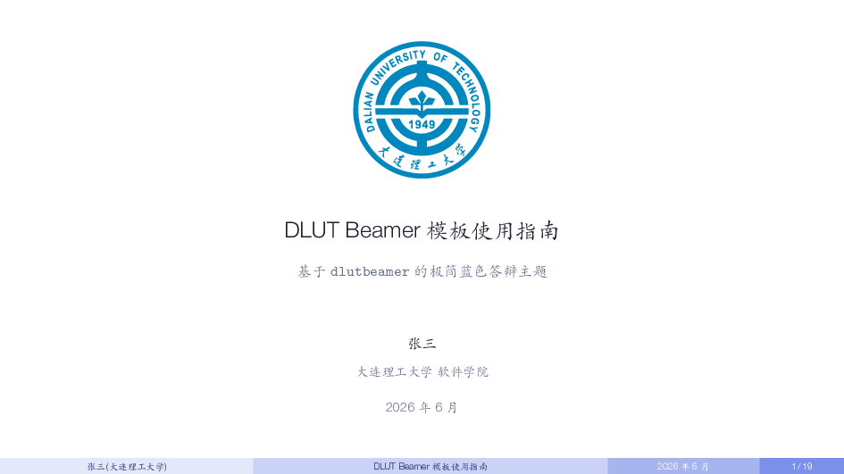
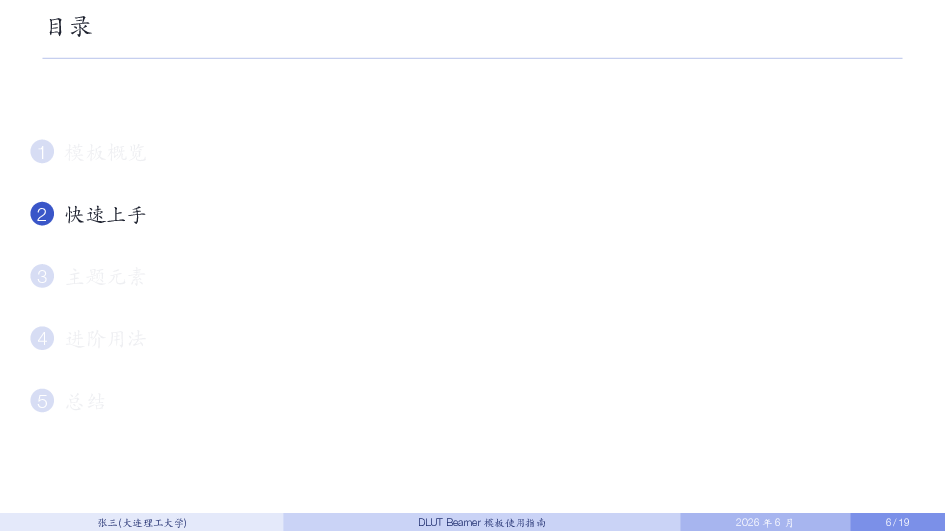
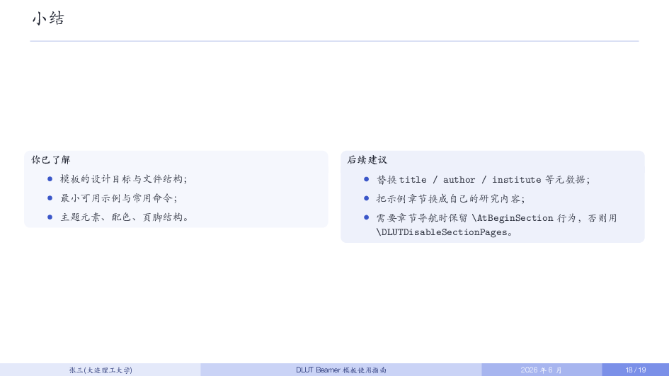

# DUT Beamer

一套面向大连理工大学本科生毕业设计（论文）答辩的极简 Beamer 主题。

主题风格独立设计，整体审美取向参考了简洁的学术答辩排版习惯
（少装饰、留白充足、克制的蓝色配色、四段渐变页脚），未直接借用
其他主题的代码。校徽素材参考自
[`iamjarryfeng/DLUT-Beamer-Slide-V2`](https://github.com/iamjarryfeng/DLUT-Beamer-Slide-V2)
中的 `pic/DLUT-logo.eps`，许可证与来源说明见
[`THIRD_PARTY_NOTICES.md`](THIRD_PARTY_NOTICES.md)。

## 效果预览

完整 19 页效果（PDF）：[`preview/main.pdf`](preview/main.pdf)

| 封面 | 正文 |
| :---: | :---: |
|  |  |
| **小结** | **封底** |
|  |  |

## 快速开始

使用 XeLaTeX 编译：

```bash
make
```

或直接调用 `latexmk`：

```bash
latexmk -xelatex -interaction=nonstopmode -halt-on-error main.tex
```

生成文件为 `main.pdf`。

## 文件结构

```text
.
├── assets/
│   ├── dlut-logo.eps           # 彩色校徽（矢量）
│   ├── dlut-logo.pdf           # 彩色校徽（PDF，编译用）
│   └── dut-logo2-trimmed.png   # 白色描线校徽（透明 PNG，用于深色背景）
├── preview/                    # 编译产物与效果预览
│   ├── main.pdf
│   └── 0*.png
├── dlutbeamer.sty              # 主题样式
├── main.tex                    # 示例正文 / 模板使用指南
├── Makefile
├── README.md
└── THIRD_PARTY_NOTICES.md
```

## 常用修改

在 `main.tex` 开头修改元数据：

```tex
\title[页脚短标题]{完整答辩标题}
\subtitle{副标题}
\author[页脚姓名]{答辩人姓名}
\institute[大连理工大学]{大连理工大学\quad 学院名称}
\date[页脚日期]{完整日期}
```

主题提供的命令：

| 命令 | 用途 |
| :--- | :--- |
| `\DLUTLogo[尺寸]` | 插入彩色校徽（默认 1.2cm） |
| `\DLUTLogoWhite[尺寸]` | 插入白色描线校徽（用于深色背景） |
| `\DLUTThankYouPage` | 渲染封底感谢页（建议放在 `\begin{frame}[plain]` 中） |
| `\DLUTSectionOverview` | 章节导航页（默认在 `\section{}` 前自动插入） |
| `\DLUTDisableSectionPages` | 关闭章节自动导航 |
| `\DLUTEnableSubsectionPages` | 在每个 `\subsection{}` 前也插入目录提示页 |
| `\SetDLUTDefenseLabel{...}` | 自定义页脚答辩标识 |
| `\SetDLUTLogoPath{...}` / `\SetDLUTLogoWhitePath{...}` | 替换校徽素材 |

预定义颜色：`DLUTBlue / DLUTAzure / DLUTNavy / DLUTDeep / DLUTSky /
DLUTMist / DLUTWarm / DLUTLine / DLUTMuted / DLUTInk / DLUTBody`，
直接以 `\color{DLUTNavy}` 等方式使用，绘制 TikZ 图表时建议引用色名
而非裸十六进制，便于后续整体换色。

`main.tex` 中还示例了三个局部排版小组件（`\ModernPlaceholder`、
`\ModernTag`、`\ModernMetric`），按需复制到自己的文档即可，未做进
主题以保持 `dlutbeamer.sty` 紧凑。

## 编译环境

- TeX Live 2024 或更新版本。
- 中文必须使用 XeLaTeX。
- 字体设置（位于 `main.tex` 开头）默认使用 macOS 系统字体：
  - CJK：通过 `\usepackage[UTF8,fontset=macnew]{ctex}` 引入 PingFang SC，
    再用 `\setCJKsansfont{Kaiti SC}` 切换为楷体；
  - Latin：`\setsansfont{Helvetica Neue}`（Light/Medium 字重）。
- 在非 macOS 系统上，把 `fontset=macnew` 改为 `fontset=fandol`，并
  注释掉 `\setsansfont` / `\setCJKsansfont` / `\setCJKmainfont` 这几个
  块即可使用 TeX Live 自带字体编译，外观会更朴素一些。
- 依赖宏包：`ctex`、`fontspec`、`tikz`、`graphicx`、`etoolbox`、
  `booktabs`、`tabularx`、`listings`。

## 素材说明

校徽属于大连理工大学标识。使用时请遵循学校的视觉标识规范。第三方
素材来源与许可证说明见 [`THIRD_PARTY_NOTICES.md`](THIRD_PARTY_NOTICES.md)。
